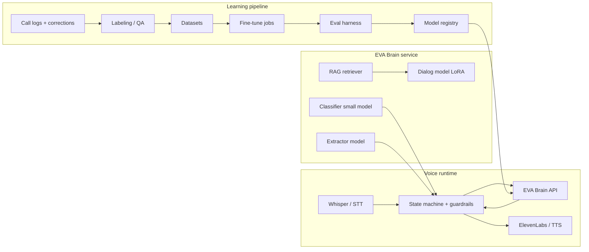

# EVA Product Polish & Custom Brain Roadmap

This document consolidates product improvement ideas and a plan to build an EVA-owned AI brain (replacing Gemini) with data-driven learning from call logs.

**Last updated:** September 2026

---

## Table of contents

1. [System overview](#1-system-overview)
2. [Product polish backlog](#2-product-polish-backlog)
3. [Custom brain strategy](#3-custom-brain-strategy)
4. [Target brain features](#4-target-brain-features)
5. [Architecture](#5-architecture)
6. [Requirements checklist](#6-requirements-checklist)
7. [Implementation phases](#7-implementation-phases)
8. [Timeline estimates](#8-timeline-estimates)
9. [Constraints and recommendations](#9-constraints-and-recommendations)

---

## 1. System overview

EVA is a **dental insurance verification** platform:

| Layer | Stack | Role |
|--------|--------|------|
| **Frontend** | React + Vite + Redux | Ops UI: dashboard, appointments, live call activity, verifications |
| **Backend** | NestJS + Prisma (MongoDB) + legacy Mongo appointments | REST, Twilio media stream, scheduler (Sabrina/Azure), barge-in, bot tracker |
| **Voice brain (today)** | **Google Gemini** in `apps/backend/src/ai/ai.service.ts` | Live dialog, extraction, classification |
| **AI server** | FastAPI (`apps/ai-server`) | Whisper transcription, RAG (Qdrant), emotion |

Reference QA: `EVA_QA_TEST_CHECKLIST.md` at repo root.

---

## 2. Product polish backlog

Short, actionable items to move EVA toward a polished product.

### Frontend

- **OPERATOR dashboard is empty** — only `ADMIN` sees appointments/verifications; define operator workflows or hide the role.
- **Replace console-only errors** — wire toasts/snackbars (`apps/client/src/utils/handlers.ts` has placeholders).
- **Remove mock benefit rows** — `STATIC_FIELDS` on appointment detail should come from API or be removed.
- **Global loading & error UX** — skeletons exist on detail; app boot still shows plain `Loading...`; add an error boundary.
- **Role-based nav** — clarify admin vs operator routes, empty states, and permissions in the UI.
- **Call supervision polish** — emotion/barge-in flags on appointment detail: clearer supervisor actions, status timeline, reconnect/retry.
- **Verification editing** — manual fix/correct fields, audit trail, export (PDF/CSV) for front desk.
- **Design system pass** — consistent spacing, empty states, mobile layout on tables and call panels.
- **API layer** — RTK Query (or similar) for caching, retries, and less duplicated Redux fetch logic.
- **Frontend tests** — none today; at least smoke tests for login, dashboard, appointment detail.

### Backend

- **Split large modules** — `media-stream.handler.ts` (~3k lines) and `ai.service.ts` (~2k lines) into testable units (state machine, prompts, persistence).
- **Global `ValidationPipe` + DTO enforcement** — not wired in `main.ts`; reduces bad payloads on voice and REST.
- **Registration hardening** — do not allow self-serve `ADMIN` via `RegisterDto.role`; use invite-only or admin-only promotion.
- **Single source of appointments** — Prisma + raw Mongo + Sabrina scheduler; finish migration and drop legacy `AppointmentID` paths.
- **Wire or remove chat** — `ChatService` is a stub; connect to `/ai/ask` + RAG or remove the endpoint.
- **Health & readiness** — `/health` for DB, Mongo, Twilio, ffmpeg, Gemini, ai-server; use in deploys.
- **Structured logging** — replace debug `console.log` (e.g. WebSocket URL in `main.ts`); correlate by `CallSid` / `appointmentId`.
- **Config consistency** — fix root `package.json` ai-server path (`apps/ai-server`), align ports (5001 vs 8000 vs `AI_SERVER_URL` default 8001).
- **Production CORS & `BACKEND_URL`** — ElevenLabs/audio URLs warn on localhost; document required env for Twilio.
- **CI pipeline** — lint, `tsc`, backend unit tests, client build (no `.github` workflows today).
- **Test coverage gaps** — Twilio/media stream, scheduler, barge-in, verification extraction largely untested.
- **PII** — SSN on payee (schema notes production requirements); encryption at rest, field-level masking in APIs, retention policy.

### AI (current Gemini / ai-server)

- **Tenant-aware persona** — “Went Dentals” / “Reena” are hardcoded in prompts and constants; drive from office/provider config per appointment.
- **Unify “brains”** — live calls use Gemini in Nest; README still emphasizes Ollama + ai-server; one product story and a clear fallback path.
- **Automate QA checklist** — scripted call scenarios or golden transcripts → expected extractions (regression on guardrails).
- **Latency budget** — voice path: STT chunking, `GEMINI_THINKING_BUDGET`, TTS (ElevenLabs); measure p95 turn time and cap reply length.
- **Extraction reliability** — JSON parse failures in Gemini extraction; schema validation, repair pass, human-review queue for low confidence.
- **RAG productization** — ingest verification transcripts per payer/plan; surface “ask EVA about this patient/plan” in UI (proxy exists at `/ai/ask`).
- **Emotion → action** — angry TPA detection exists; tie to supervisor alert, call pause script, or automatic barge-in rules.
- **IVR / TPA library** — expand `tpa-ivr.ts` patterns from QA checklist (hold, transfer, “member not found”).
- **Evaluation metrics** — field accuracy, repeat-question rate, call duration, % N/A vs fabricated (guardrails already help).
- **ai-server ops** — Qdrant dependency, embedder init on startup, auth on `/rag/*`, CORS for production hosts.

### Cross-cutting (quick wins)

- Refresh **README** (Mongo not SQLite, `apps/client`, current Twilio/Gemini flow).
- **Docker Compose** for backend + client + ai-server + Qdrant with one dev command.
- **Feature flags** for scheduler/Azure Service Bus so local dev does not depend on Sabrina UAT.

### Suggested priority lane

Highest leverage for “polished product”: **tenant config + OPERATOR UX + automated voice QA regressions + splitting the media-stream handler**.

---

## 3. Custom brain strategy

### What “your own brain” should mean (realistic)

You typically do **not** train a foundation model from scratch. You build a **platform** that combines:

| Layer | Role |
|--------|------|
| **Rules + state machine** | Field order, TPA gates, guardrails (much already exists) |
| **Specialized models** | Extraction, classification, short replies (fine-tuned open models) |
| **RAG** | Payer/plan scripts, past successful calls, office config (Qdrant + `/rag`) |
| **Learning loop** | Logs → labels → retrain → evaluate → promote (not unchecked auto-deploy) |

**“Automatically learns from logs”** in production should mean **continuous improvement with human review** for benefit values and identity. Fully unattended online learning on insurance fields is too risky for a regulated verification product.

### Current Gemini responsibilities (`AiService`)

Map custom brain to these entrypoints (keep the same contract or a `BrainProvider` behind `AiService`):

| Method | Use |
|--------|-----|
| `getNextConversationTurn` | Main live voice loop (structured JSON: reply + updates) |
| `handleInterruption` | Barge-in / interrupt handling |
| `classifySegment` | Segment classification |
| `replyToUser` | Short conversational replies |
| `extractInsuranceDetails` | Legacy/audio extraction |
| `extractVerificationFieldsFromTranscript` | Configurable field extraction |
| `validateAndNormalizeBenefitExtracted` | **Keep as code** — model proposes, rules validate |

Call sites include `media-stream.handler.ts`, `verification.service.ts`, `transcription.controller.ts`.

---

## 4. Target brain features

### Conversation (voice)

- Turn-taking with **structured output** (reply text + `extractedUpdates` + dialog phase), matching the current JSON contract.
- Tenant persona (office name, agent name) from DB, not hardcoded prompts.
- Identity Q&A from patient context only when asked.
- Benefit Q&A only after TPA gate (policy enforced in code + model hints).
- Interruption / barge-in / hold / repeat-question handling.
- Latency target: **&lt; 800 ms–1.5 s** model time per turn (excluding STT/TTS).

### Understanding

- Intent/segment classification (greeting, identity ask, benefit answer, correction, small talk, end call).
- Slot filling for configurable `verificationFields`.
- Multi-field answers in one utterance.
- Confidence scores per field (route low confidence to re-ask or human review).

### Extraction & memory

- Transcript → structured verification record.
- Normalization (money, dates, %, group name) — deterministic code remains authoritative.
- RAG over successful calls, payer IVR notes, playbooks, corrected verifications.

### Learning & operations

- **Call log ingestion**: audio ref, STT text, model I/O, final DB outcome, operator edits.
- **Feedback capture**: thumbs-down, field corrections in UI, supervisor barge-in events.
- **Dataset builder**: export SFT pairs (context → ideal assistant message + JSON).
- **Offline eval**: golden transcripts + `EVA_QA_TEST_CHECKLIST` as automated scores.
- **Model registry**: version, metrics, rollback.
- **Safe promotion**: shadow mode (new brain suggests, current model executes) → canary → full swap.

### Non-functional

- No training on raw PHI in shared SaaS without appropriate agreements; prefer self-hosted GPUs + encrypted storage.
- Audit trail: which model version produced which field value.
- PII redaction in training exports.

### Recommended model split (three models, not one monolith)

1. **Dialog model** (7B–14B class, LoRA): short replies + JSON updates in call context.
2. **Extractor** (smaller or same base): transcript → fields JSON (batch / end-of-turn).
3. **Classifier** (tiny fine-tune or rules + embeddings): segment type for routing.

RAG handles “what does this payer usually say?”; the state machine handles “when am I allowed to ask deductible?”

---

## 5. Architecture

**Integration point:** Extend `apps/ai-server` or add `apps/brain` with OpenAPI; Nest uses `BrainClient` implementing the same methods as today’s Gemini paths in `AiService`.

---

## 6. Requirements checklist

### Data

- [ ] **Minimum viable training set**: 500–2,000 **full calls** with transcripts (more is better; quality &gt; quantity).
- [ ] **Structured labels**: per-turn ideal reply + extracted fields + phase (identity / benefits / closing).
- [ ] **Correction data**: every operator edit to verification = gold label.
- [ ] **Negative examples**: hallucinations, wrong types, re-asks (from failed QA).
- [ ] **Payer/office metadata** linked to each call for retrieval and per-tenant tuning.
- [ ] **De-identification pipeline** for model training copies (or train only in a compliant enclave).

### Logging (required before “learning”)

- [ ] Persist: STT final, prompt context snapshot (or hash), raw model output, parsed JSON, guardrail overrides, latency, `CallSid`, model version.
- [ ] Link log row → final `Verification` record and **diff** if user edited.

### Infrastructure

- [ ] **GPU training**: 1–4× A100/H100 class (cloud burst OK) for LoRA.
- [ ] **GPU inference**: vLLM / TGI / TensorRT-LLM on L4/A10 or similar; separate dev/staging/prod.
- [ ] **Vector DB**: Qdrant (existing in ai-server).
- [ ] **Object storage**: audio + transcript archives.
- [ ] **MLOps**: experiment tracking (MLflow/W&B), artifact store, scheduled retrain jobs.
- [ ] **Feature store** (optional early): indexed “successful patterns per payer”.

### Software & team

- [ ] **Brain service**: OpenAPI, auth, rate limits.
- [ ] **Nest adapter**: `BrainClient` / `BrainProvider` behind `AiService`.
- [ ] **Eval CI**: regression on golden set on every model bump.
- [ ] **Annotation tool**: Label Studio / Argilla / internal UI for QA team.
- [ ] **Roles (typical)**: 1 ML engineer, 1 backend, 0.5 domain QA (insurance verification), optional data engineer.

### Compliance & product

- [ ] Policy: **human approval** before auto-deploy of new weights.
- [ ] Retention and access control on call logs.
- [ ] Fallback: keep Gemini (or second provider) behind feature flag until metrics beat baseline.

### Base model candidates (review licenses for your deployment)

- Dialog/extract: Llama 3.x, Mistral, Qwen2.5.
- Embeddings: bge-small / e5 (align with existing RAG embedder).
- STT: keep Whisper (separate from dialog brain; optional fine-tune later).

---

## 7. Implementation phases

### Phase 0 — Foundation (no custom weights yet)

1. Define `BrainProvider` interface mirroring `AiService` public LLM entrypoints.
2. Instrument **full call traces** end-to-end.
3. Build **golden eval set** from QA checklist + 50–100 real (redacted) scenarios.
4. Baseline metrics with Gemini: field accuracy, re-ask rate, avg turns, latency.

### Phase 1 — RAG-first brain (fastest win)

1. Ingest transcripts, verification outcomes, payer docs into Qdrant per tenant.
2. Replace static prompts with retrieved examples + office config.
3. Wire Nest `ChatService` / UI “ask about this verification” to RAG.
4. Proves data flywheel; dialog may still use an API LLM.

### Phase 2 — Specialized extraction model

1. Train LoRA on `(transcript + field schema) → JSON` from historical calls + corrections.
2. Keep `validateAndNormalizeBenefitExtracted` as authority.
3. Swap `extractInsuranceDetails` / `extractVerificationFieldsFromTranscript` to brain service.
4. Run offline eval until meeting target (e.g. ≥95% F1 on required fields vs Gemini baseline).

### Phase 3 — Dialog model for live calls

1. SFT on multi-turn traces: state + last N turns + RAG → message + `extractedUpdates`.
2. Enforce JSON schema (constrained decoding or repair pass).
3. **Shadow mode**: new model proposes, Gemini still speaks; compare logs.
4. Canary on test lines, then partial production traffic.

### Phase 4 — Continuous learning

1. Weekly job: new logs + corrections → dataset version bump.
2. Retrain LoRA adapters (not full foundation weights).
3. Auto-run eval; **manual promote** if metrics pass.
4. Optional: DPO / light preference learning from supervisor-rated calls.

### Phase 5 — Deprecate Gemini

1. Feature flag `BRAIN_PROVIDER=eva|gemini`.
2. Monitor latency, cost, failure rate, human escalation.
3. Document rollback and per-tenant model pins.

---

## 8. Timeline estimates

Assumptions: existing EVA codebase, some call history, ~1 ML engineer + ~1 backend developer (part-time), QA help for labeling.

| Phase | Deliverable | Duration (calendar) |
|--------|-------------|---------------------|
| 0 | Logging, eval harness, provider abstraction | **6–10 weeks** |
| 1 | RAG brain + tenant config in prompts | **4–8 weeks** (can overlap Phase 0) |
| 2 | Custom extraction LoRA in production | **8–14 weeks** |
| 3 | Custom dialog model + shadow/canary on voice | **12–20 weeks** |
| 4 | Automated retrain + promote workflow | **8–12 weeks** |
| 5 | Gemini off (production) | **2–4 weeks** after Phase 3 metrics met |

**End-to-end (serial, small team):** ~**12–18 months** to a production-owned brain with a learning loop.

**Aggressive (experienced ML team, parallel work, hybrid fallback for edge cases):** ~**6–9 months** for your model on most calls.

**Phase 1 only (RAG + rules, external LLM for dialog):** ~**2–4 months** — not fully self-trained, but reduces single-vendor lock-in for knowledge.

**Bottleneck:** labeled corrections and QA time; without them, Phases 2–3 slip significantly.

---

## 9. Constraints and recommendations

- **Self-trained ≠ zero Gemini on day one** — use distillation or Gemini-as-judge until offline eval wins.
- **Voice latency** may require a **smaller** dialog model than offline extraction.
- **Auto-learn** = auto-dataset + auto-retrain + **human promote**, not silent weight updates on live calls.
- **Guardrails and state machine stay** — the model is the flexible part inside a strict shell.

### Optional next artifacts

- One-page Brain PRD mapped to files: `ai.service.ts`, `media-stream.handler.ts`, `apps/ai-server/rag`.
- Minimal `BrainProvider` TypeScript interface matching exact JSON shapes from `getNextConversationTurn`.

---

## Document history

| Date | Notes |
|------|--------|
| 2026-09 | Initial consolidation of product polish backlog + custom brain roadmap |
